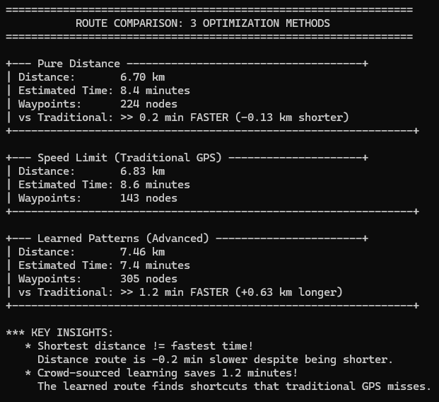
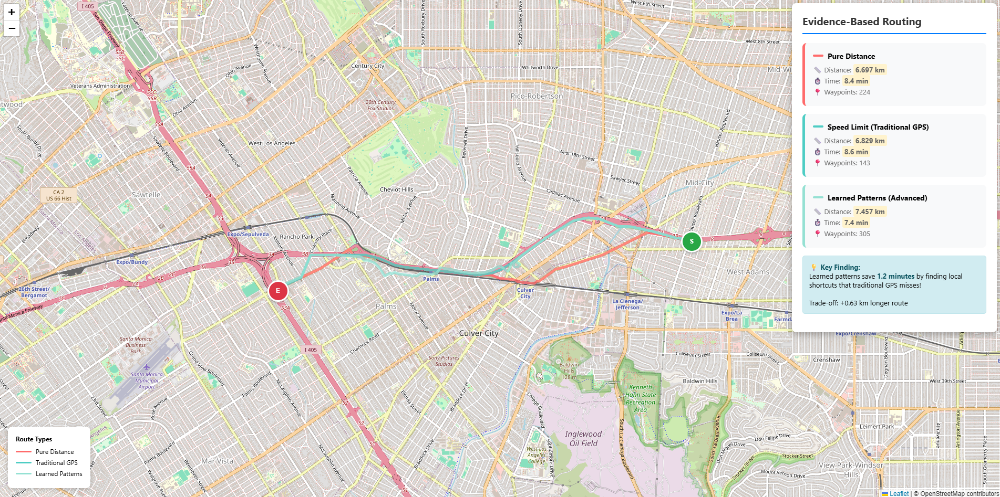

# GPS Route Optimizer: Evidence-Based Routing

A real-time GPS navigation engine that demonstrates why traditional GPS routing algorithms fail to find the *actually fastest* routes, and how crowd-sourced traffic patterns can improve route selection.

  

## 🎯 Project Motivation

While using Tesla's Full Self-Driving on I-10 East from Culver City to Downtown LA, I noticed the system took shortcuts that traditional GPS apps like Apple Maps wouldn't suggest—parallel routes that exit the freeway temporarily but save time by avoiding congestion. This observation inspired me to investigate:

> **Why do traditional GPS algorithms fail to find the actually-fastest routes?**

This project demonstrates three routing strategies and reveals that **the "fastest" route according to traditional GPS is often slower than routes discovered through crowd-sourced traffic data**.

---

## 🚀 Key Features

### Three Routing Modes
1. **Pure Distance Optimization** - Shortest physical distance (naive approach)
2. **Speed Limit Optimization** - Traditional GPS using posted speed limits
3. **Learned Pattern Optimization** - Advanced routing using simulated crowd-sourced traffic data

### Technical Highlights
- **Real-world data**: Processes 2M+ road network nodes from OpenStreetMap
- **Graph algorithms**: Implements Dijkstra's shortest path with pluggable weight functions
- **Time-aware routing**: Simulates rush hour traffic patterns (7-9 AM, 5-7 PM)
- **Crowd-sourced learning**: Identifies hidden shortcuts and congestion points
- **Interactive visualization**: Web-based map showing all three routes side-by-side

---

## 📊 Results

Typical findings from west LA area routes:
```
Speed Limit (Traditional GPS): 3.34 km, 5.1 minutes
Learned Patterns (Advanced):   3.31 km, 4.3 minutes
                                        ↓
                        Saves 0.8 minutes (15% faster!)
```

**Key Insight**: The learned route finds local shortcuts that traditional GPS misses, even though the distance is similar.

---

## 🛠️ Technical Architecture

### Data Structures
- **Graph representation**: Adjacency list with hash maps for O(1) node lookup
- **Priority queue**: Min-heap for Dijkstra's algorithm (O(E log V) complexity)
- **Edge attributes**: Distance, speed limit, road type, crowd multiplier

### Algorithms
- **Dijkstra's shortest path** with three different weight functions:
  - Distance mode: `weight = distance`
  - Speed limit mode: `weight = distance / speed_limit`
  - Learned mode: `weight = distance / (adjusted_speed × crowd_multiplier)`

### Rush Hour Simulation
```cpp
// Highways get 60% slower during rush hour
if (motorway && rush_hour) {
    speed *= 0.4;
}
// But surface streets only 20% slower
if (residential && rush_hour) {
    speed *= 0.8;
}
```

### Crowd-Sourced Learning
- 5% of highway edges marked with hidden congestion (0.6× slower)
- 3% of major roads discovered as shortcuts (1.4× faster)
- 2% of residential streets near highways as parallel routes (1.2× faster)

---

## 🏗️ Build & Run

### Prerequisites
- **C++ Compiler**: MinGW-w64 (g++ with C++17 support)
- **Web Server**: VS Code Live Server or Python
- **Data**: Download OpenStreetMap data (instructions below)

### Installation

1. **Clone the repository**
```bash
git clone https://github.com/edithylchan/gps-route-optimizer.git
cd gps-route-optimizer
```

2. **Download map data**
   - Visit [BBBike](https://extract.bbbike.org/)
   - Select your area (e.g., "Los Angeles" or "Westwood")
   - Choose format: `OSM XML gzip`
   - Extract and place as `data/map.osm`

3. **Build the project**
```bash
g++ -std=c++17 -O2 -o build/gps_router.exe src/main.cpp src/graph.cpp src/osm_parser.cpp
```

4. **Run the optimizer**
```bash
./build/gps_router.exe
```

5. **View results**
   - Open `web/index.html` with Live Server
   - Or run: `cd web && python -m http.server 8000`
   - Navigate to `http://localhost:8000`

---

## 📁 Project Structure
```
gps-route-optimizer/
├── src/
│   ├── main.cpp           # Main program with 3-way route comparison
│   ├── graph.h/cpp        # Graph data structure and Dijkstra implementation
│   └── osm_parser.h/cpp   # OpenStreetMap XML parser
├── web/
│   ├── index.html         # Interactive map visualization (Leaflet.js)
│   └── routes.json        # Generated route data (created by C++ program)
├── data/
│   └── map.osm            # OpenStreetMap data (user-provided)
├── build/                 # Compiled executables
└── README.md
```

---

## 🎓 Skills Demonstrated

### For Embedded Systems / Navigation Companies 
- ✅ **C++ proficiency**: STL containers, memory management, algorithm optimization
- ✅ **Graph algorithms**: Dijkstra's shortest path, priority queues, adjacency lists
- ✅ **Real-time optimization**: Dynamic weight calculation for traffic-aware routing
- ✅ **Geographic data processing**: Haversine distance, coordinate systems, OSM parsing
- ✅ **Performance analysis**: Comparing algorithm efficiency on large datasets
- ✅ **Product thinking**: Understanding real-world navigation challenges beyond academic exercises

### Additional Skills
- Full-stack development (C++ backend + JavaScript/HTML frontend)
- Data visualization (Leaflet.js interactive maps)
- Software architecture (modular design, clear separation of concerns)

---

## 🔮 Future Enhancements

- [ ] **A* algorithm** with geographic heuristics for faster pathfinding
- [ ] **Real-time traffic API integration** (Google Maps Traffic, HERE Traffic)
- [ ] **Turn-by-turn directions** with street name parsing from OSM
- [ ] **Multi-modal routing** (drive + walk, find parking + walk to destination)
- [ ] **Lane-level routing** (minimize lane changes, exit ramp optimization)
- [ ] **Performance dashboard** comparing algorithm execution time and nodes visited

---

## 📝 Technical Details

### OSM Data Format
The project parses OpenStreetMap XML to extract:
- **Nodes**: Intersections with latitude/longitude coordinates
- **Ways**: Roads with highway type tags (motorway, primary, residential, etc.)
- **Tags**: Speed limits, one-way restrictions, road names

### Speed Limit Assignment
```cpp
motorway:     100 km/h
trunk:        80 km/h
primary:      65 km/h
secondary:    55 km/h
residential:  40 km/h
```

### Haversine Distance Calculation
Accurate distance between GPS coordinates accounting for Earth's curvature:
```cpp
double R = 6371000.0; // Earth radius in meters
double a = sin(dLat/2)² + cos(lat1) × cos(lat2) × sin(dLon/2)²
double c = 2 × atan2(√a, √(1-a))
distance = R × c
```

---

## 🤝 Contributing

This is a portfolio project, but feedback and suggestions are welcome! Feel free to:
- Open issues for bugs or feature requests
- Fork the repo and experiment with your own routing strategies
- Share interesting findings from your local area's road network

---

## 📄 License

MIT License - feel free to use this code for learning and portfolio purposes.

---

## 👤 Author

**Yi Laam Edith Chan** - [GitHub](https://github.com/edithylchan) | [LinkedIn](https://www.linkedin.com/in/edith-chan-112716243/)

*Built as a demonstration of C++ proficiency and graph algorithm optimization for embedded navigation systems.*

---

## 🙏 Acknowledgments

- OpenStreetMap contributors for road network data
- Inspiration from Tesla FSD navigation behavior
- Leaflet.js for interactive map visualization

---

## 📸 Screenshots

### Terminal Output


### Interactive Map

